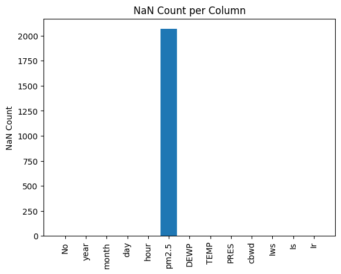
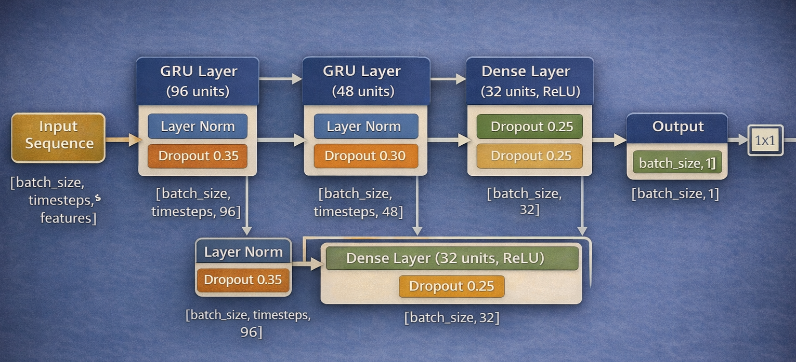
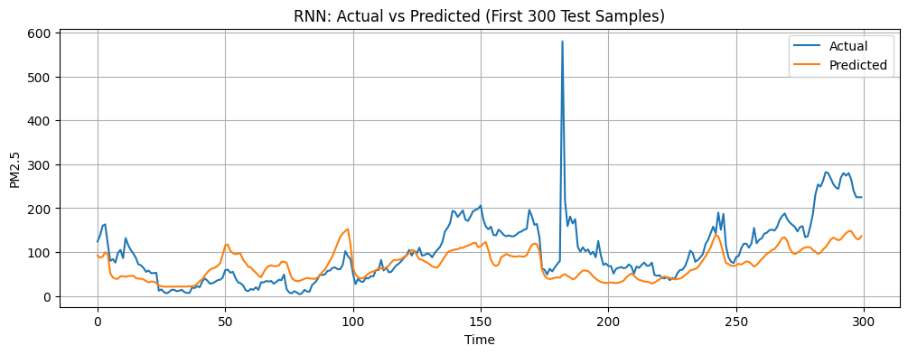

# Forecasting Air Quality

## 1. Inspiration

Air quality has a direct and measurable impact on public health, yet many existing tools focus primarily on reporting historical conditions rather than anticipating future trends. This project explores whether a compact, data-driven neural network can reliably forecast near-term PM2.5 concentrations using historical observations and time-based signals. Rather than attempting to model atmospheric physics explicitly, the goal is to learn how air pollution evolves over time from data alone, producing practical short-horizon forecasts that could support awareness and decision-making.

---

## 2. Working with Real Air Quality Data

This project uses publicly available hourly air quality data containing PM2.5 measurements alongside temporal information. As is common with environmental datasets, the raw data included missing values — approximately 2,000 PM2.5 readings across 43,000 hourly time steps. Because sequence models require continuous inputs, missing values were handled using forward and backward filling to preserve temporal continuity while minimizing distortion of underlying trends. To capture periodic pollution patterns, we engineered cyclical time features by applying sine and cosine transformations to hour, day, and month variables. These features allow the model to learn daily and seasonal dynamics in air quality. After cleaning and feature construction, the dataset was reshaped into fixed-length sequences suitable for recurrent neural networks. This preprocessing step was critical for enabling the model to learn meaningful temporal dependencies and produce stable forecasts.

---
## 3. Modeling Approach

To establish a fair and informative comparison, we evaluate three commonly used recurrent architectures for time-series forecasting: a simple Recurrent Neural Network (RNN), Long Short-Term Memory (LSTM), and Gated Recurrent Unit (GRU). Each model is trained and evaluated under identical data preprocessing, sequence length, and training conditions to ensure comparability.

Model performance is assessed using Root Mean Squared Error (RMSE) on a held-out validation set, as RMSE directly reflects the magnitude of prediction error in PM2.5 concentration. The architecture achieving the lowest validation RMSE is selected as the base model for further experimentation.

Once the best-performing recurrent architecture is identified, we fine-tune it through targeted adjustments to hyperparameters such as hidden size, number of layers, learning rate, and regularization. This two-stage approach—broad model comparison followed by focused fine-tuning—ensures that performance gains are driven by architectural suitability rather than differences in training conditions.

## 4. Model Performance Comparison

The table below summarizes the test performance of different recurrent architectures evaluated under identical training and preprocessing conditions. Performance is reported using Root Mean Squared Error (RMSE) and Mean Absolute Error (MAE) on PM2.5 concentration predictions.

| Model       | Test RMSE (PM2.5) | Test MAE (PM2.5) |
|-------------|------------------:|-----------------:|
| Simple RNN  | 58.76             | 44.53            |
| LSTM        | 62.75             | 46.33            |
| **GRU**     | **56.49**         | **42.19**        |

**Lower values indicate better predictive performance.**  

Based on these results, the GRU architecture achieved the lowest prediction error and was selected as the base model for further refinement. In the next stage, we fine-tune the GRU to improve its ability to capture short- and medium-term pollution dynamics.

## 5. Fine-Tuning GRU

After identifying the GRU as the best-performing recurrent architecture, we further improved its predictive capability through targeted fine-tuning. Rather than increasing model complexity arbitrarily, fine-tuning focused on stabilizing training, improving generalization, and capturing both short- and medium-term temporal dependencies in PM2.5 data.

---

## Model Architecture

The fine-tuned GRU model consists of two stacked GRU layers followed by fully connected layers:

- **First GRU layer (96 units)**  
  This layer captures longer temporal dependencies by processing the full input sequence (`return_sequences=True`). It learns broad pollution trends influenced by historical patterns and time-based features.

- **Second GRU layer (48 units)**  
  This layer focuses on refining the temporal representation produced by the first GRU, emphasizing more localized and recent changes in PM2.5 levels.

Both GRU layers use the `tanh` activation function, which is well-suited for sequence modeling and helps maintain stable gradients over time.

---

## Regularization and Stabilization

To reduce overfitting and improve training stability, multiple regularization techniques are applied:

- **L2 regularization** on both kernel and recurrent weights penalizes overly complex temporal patterns.
- **Layer Normalization** is applied after each GRU layer to stabilize hidden state dynamics and improve convergence.
- **Dropout** is progressively applied with decreasing rates (0.35 → 0.30 → 0.25), encouraging robustness without overly suppressing useful signals.

These choices help the model generalize better to unseen data while remaining compact.

---

## Dense Layers and Output

Following the recurrent layers:
- A fully connected layer with 32 units and ReLU activation learns higher-level interactions between temporal features.
- The final dense layer outputs a single continuous value representing the predicted PM2.5 concentration.

---

## Optimization Strategy

The model is trained using the **Adam optimizer** with a learning rate of `3 × 10⁻⁴`, providing a balance between convergence speed and stability. Gradient clipping (`clipnorm=1.0`) is used to prevent exploding gradients, which can occur in recurrent networks.

---

## Loss Function

We use the **Huber loss** with `δ = 1.0`, which combines the advantages of mean squared error and mean absolute error:
- Penalizes large errors smoothly
- It is more robust to outliers commonly present in environmental data

The model is evaluated using Mean Absolute Error (MAE) for interpretability in real-world PM2.5 units.

---

## Summary

This fine-tuned GRU model improves upon the baseline by:
- Leveraging deeper temporal representations
- Applying structured regularization and normalization
- Using a robust optimization and loss strategy

These refinements result in lower prediction error and improved directional accuracy, thereby making the model more reliable for near-term air quality forecasting.

## 6. Final Results

| Model           | Test RMSE (PM2.5) | Test MAE (PM2.5) | Directional Accuracy (%) |
|-----------------|------------------:|-----------------:|--------------------------:|
| Simple RNN      | 60.99             | 46.44            | 54.97                     |
| LSTM            | 62.75             | 46.33            | 54.97                     |
| GRU             | 58.86             | 44.93            | 54.97                     |
| **GRU (Fine-Tuned)** | **56.56**     | **40.05**        | **57.15**                 |

**Lower RMSE and MAE indicate better predictive accuracy, while higher directional accuracy reflects improved trend prediction.**  
The fine-tuned GRU model achieves the best overall performance across all evaluation metrics.

## 7. References

- **Beijing PM2.5 Dataset (UCI Machine Learning Repository)**  
  Primary data source containing hourly PM2.5 measurements and meteorological features.  
  [https://archive.ics.uci.edu/dataset/381/beijing+pm2+5+data](https://archive.ics.uci.edu/dataset/381/beijing+pm2+5+data)
